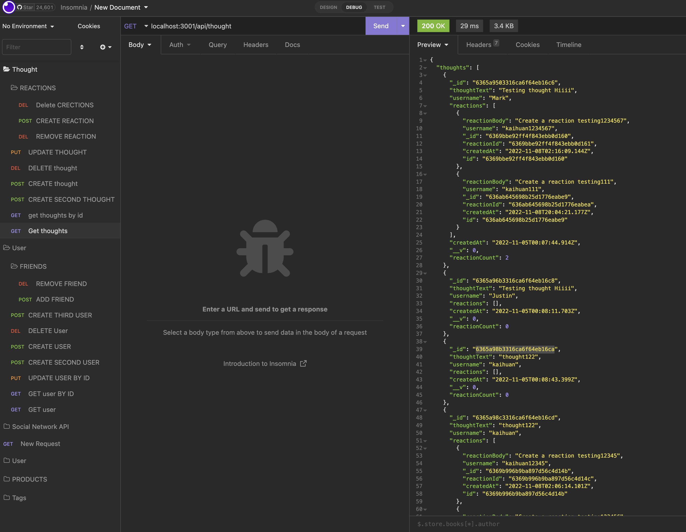

# Social-Network-API---NoSQL-MongoDB-database


## Table of Contents
* [Description](#description)
* [Assets](#assets)
* [Assets](#assets)
* [Installation](#installation)
* [Usage](#usage)
* [Contributing](#contributing)
* [Questions](#questions)

## Description
Social-Network-API where users can share their thoughts, react to friends’ thoughts, and create a friend list. Used Express.js for routing, a MongoDB database, and the Mongoose ODM.

- Deployed link: https://github.com/kaihuan-huang/Social-Network-API---NoSQL-MongoDB-database


## More details
```
AS A social media startup
I WANT an API for my social network that uses a NoSQL database
SO THAT my website can handle large amounts of unstructured data

GIVEN a social network API
WHEN I enter the command to invoke the application
THEN my server is started and the Mongoose models are synced to the MongoDB database
WHEN I open API GET routes in Insomnia for users and thoughts
THEN the data for each of these routes is displayed in a formatted JSON
WHEN I test API POST, PUT, and DELETE routes in Insomnia
THEN I am able to successfully create, update, and delete users and thoughts in my database
WHEN I test API POST and DELETE routes in Insomnia
THEN I am able to successfully create and delete reactions to thoughts and add and remove friends to a user’s friend list
```
## Assets

The following images demonstrate the web application's appearance and functionality in Insomnia:




## Installation 
The user should clone the repository from GitHub and download Node. 
Run `npm install ` to install.
Run `npm run seed ` to run the database.
Run `npm start ` to start the Social-Network-API.

## Usage 
Use inquirer from your command line to answer questions about your project.
View walk through video here - [Social-Network-API](https://drive.google.com/file/d/1zeQ3AUeuJwaU9InUIp6IfpriZZGwY-zE/view)<br>


## Contributing 
Contributors should read the installation section. 

## Technologies used

```
 Express.js API 
  Mongoose packages
  tested in Insomnia
  MongoDB database
```
## Questions
If you have any questions about this projects, please contact me directly at huangkaihuan0216@gmail.com. You can view more of my projects at https://github.com/kaihuan-huang.

## Made by 
```
Kaihuan Huang

```